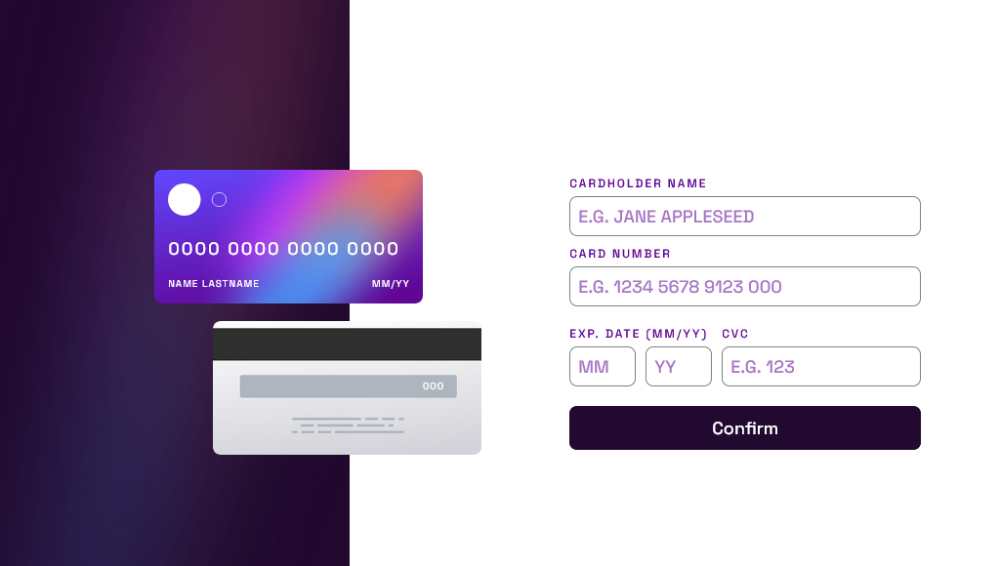
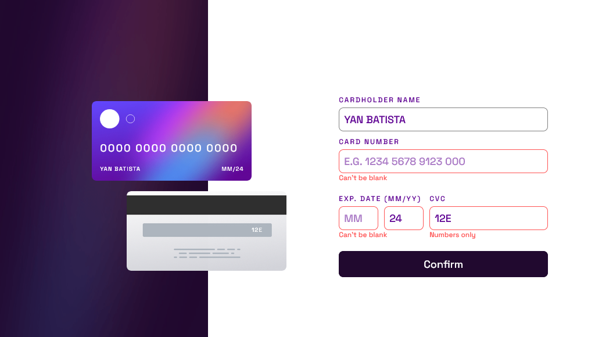
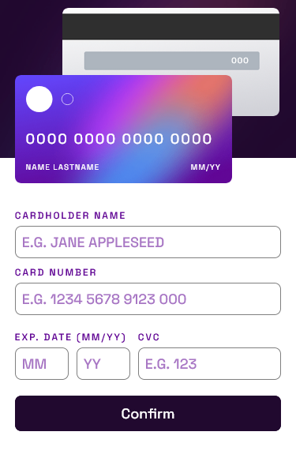
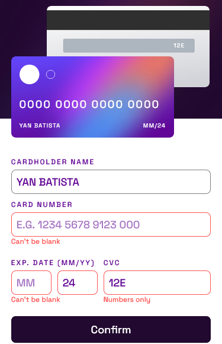

# Frontend Mentor - Interactive card details form solution

This is a solution to the [Interactive card details form challenge on Frontend Mentor](https://www.frontendmentor.io/challenges/interactive-card-details-form-XpS8cKZDWw).

## Table of contents

---

- [Overview](#overview)
  - [The challenge](#the-challenge)
  - [Screenshot](#screenshot)
  - [Links](#links)
- [My process](#my-process)
  - [Built with](#built-with)
  - [What I learned](#what-i-learned)
- [Author](#author)

## Overview

---

### The challenge

Users should be able to:

- [x] Fill in the form and see the card details update in real-time
- [x] Receive error messages when the form is submitted if:
  - [x] Any input field is empty
  - [x] The card number, expiry date, or CVC fields are in the wrong format
- [x] View the optimal layout depending on their device's screen size
- [x] See hover, active, and focus states for interactive elements on the page

### Screenshot





|                Mobile                |                   Errors                    |                   Complete                    |
| :----------------------------------: | :-----------------------------------------: | :-------------------------------------------: |
|  |  |  |

### Links

- Solution URL: [Solution](https://www.frontendmentor.io/solutions/interactive-card-details-form-IMtXOseiJ1)
- Live Site URL: [Vercel](https://interactive-credit-card-xi.vercel.app)

## My process

---

### Built with

- Flexbox
- Mobile-first workflow
- TypeScript
- [React](https://reactjs.org/) - JS library
- [Styled Components](https://styled-components.com/) - For styles

### What I learned

**Use of props with React Typescript and Styled Components.**

In one of the parts of the code, I only display an element if it is validated. There is a state in the form that checks the validation, and the display of the element changes between "none" and "flex" based on the state.

In the .tsx file, I use props normally

```html
<CompleteContainer completeForm="{validation}"> ... </CompleteContainer>
```

In the .ts styled components file I follow the structure `styled.element<{myProp}>`.

The props then can be accessed by `${props => props.myProp}`.

```typescript
export const CompleteContainer = styled.div<{ completeForm: boolean }>`
  display: ${(props) => (props.completeForm ? "flex" : "none")};
`;
```

## Author

---

- Frontend Mentor - [@yan-batista-1326](https://www.frontendmentor.io/profile/yan-batista-1326)
- LinkedIn - [@YanBatista](https://www.linkedin.com/in/yanbatista/)
